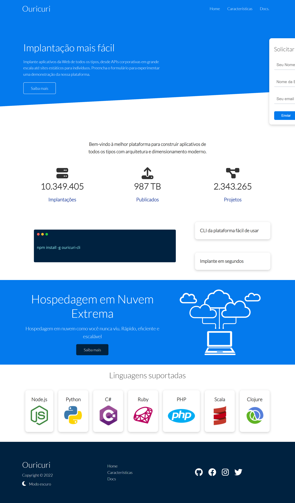

# Recriando o projeto "Build a Responsive Website | HTML, CSS Grid, Flexbox & More"

Tive a inspiração de [reproduzir o projeto](https://www.youtube.com/watch?v=p0bGHP-PXD4) originalmente criado pelo o canal no Youtube [Traversy Media](https://www.youtube.com/c/TraversyMedia), no qual sua proposta é criar 3 páginas HTML e utilizar tecnologias das mais variadas. O conteúdo original não contém uma estrutura de classes no HTML que favorece o SASS, como foquei em apenas rescrever o CSS através do SASS deixei o HTML de lado, mesmo assim apliquei melhorias e abordagem diferente de acordo com minhas convicções conforme listado a seguir.

[](https://gleristoncastro.com.br/portfolio/github/preview/Websites-Practice/1_ouricuri_host/)


_Para visualizar o preview do projeto clique na imagem acima._

> **Atenção**: O nome utilizado "Ouricuri" foi inspirado em uma cachoeira que visitei recentemente e o projeto se trata de uma empresa fictícia de Hospedagem na nuvem.
______________________
### Melhorias/Atualizações

- Refatorei todo o código do css para ser transpilado através do SASS.
- Coloquei todo o idioma da página em português.
- Melhorei o código HTML e CSS.
- Adicione o modo escuro.
- A responsividade foi melhorada.

O comando abaixo não existe, apenas serviu para ilustrar uma imagem no projeto

``` console
npm install -g ouricuri-cli
```
______________________
### Agradecimentos/Créditos:
- [Traversy Media](https://www.youtube.com/c/TraversyMedia)
- [Font Awesome](https://fontawesome.com/)
- [Google Fonts](https://fonts.google.com/)
______________________
### Dificuldades

Neste projeto tive dificuldade por não conhecer GRID, entendi muito pouco, já marquei nas anotações para aprender sobre o assunto!